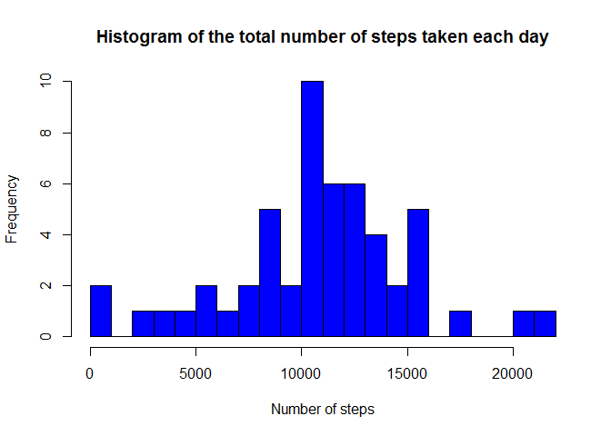
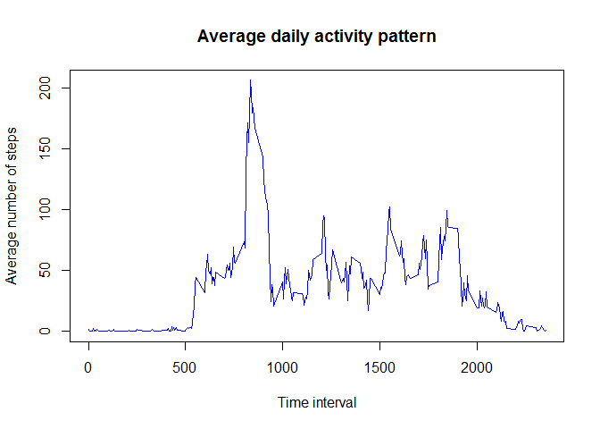
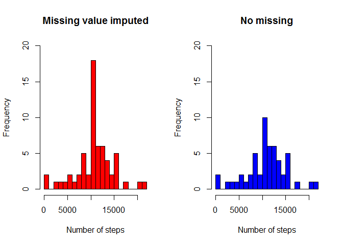
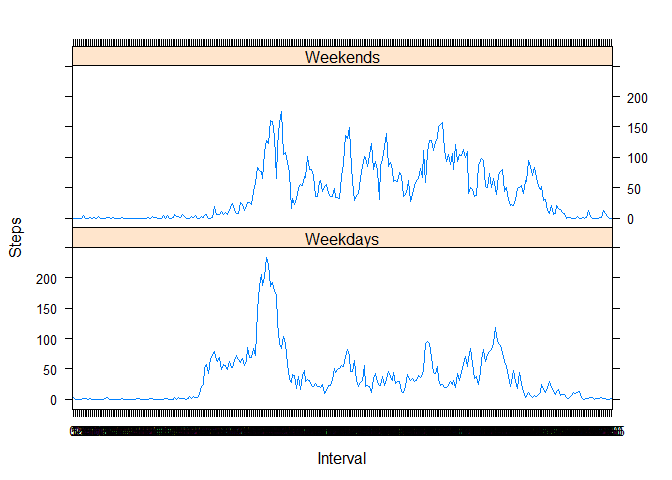

## Loading and preprocessing the data


```r
setwd("C:/Users/may/Desktop/DataScience/Reproducible_Research/Week2/Project1/RepData_PeerAssessment1")
unzip("activity.zip",exdir = getwd())
activity<-read.csv("activity.csv")
#change date to date variable
activity$date<-as.Date(activity$date,"%Y-%m-%d")
activity$interval <- factor(activity$interval)
```

## What is mean total number of steps taken per day?
### Make a histogram of the total number of steps taken each day  

```r
#remove NA data from the analysis
NA_indication <- is.na(as.character(activity$steps))
activity_no_NA <- activity[!NA_indication,]
#histogram
day_total<-with(activity_no_NA,tapply(steps,date,sum))
day_total<-as.data.frame(day_total)
hist(day_total$day_total,breaks = 20,col="blue",xlab="Number of steps",main="Histogram of the total number of steps taken each day")
```

<!-- -->

### Calculate and report the mean and median total number of steps taken per day

```r
#mean
mean(day_total$day_total)
```

```
## [1] 10766.19
```

```r
#median
median(day_total$day_total)
```

```
## [1] 10765
```

## What is the average daily activity pattern?  
### Make a time series plot (type="l") of the 5-minute interval (x-axis) and the average number of steps taken, averaged across all days (y-axis)

```r
day_mean<-with(activity_no_NA,tapply(steps,interval,mean))
day_mean<-as.data.frame(day_mean)
x<-row.names(day_mean)
with(day_mean,plot(x,day_mean,type="l",xlab = "Time interval",ylab="Average number of steps",main="Average daily activity pattern",col="blue"))
```

<!-- -->

### Which 5-minute interval, on average across all the days in the dataset, contains the maximum number of steps?

```r
day_mean$interval<-x
max_interval<-day_mean[which.max(day_mean$day_mean),]$interval
max_interval
```

```
## [1] "835"
```

```r
max(day_mean$day_mean)
```

```
## [1] 206.1698
```

## Imputing missing values
### Calculate and report the total number of missing values in the dataset (i.e. the total number of rows with NAs)

```r
#steps variable missing
sum(is.na(as.character(activity$steps)))
```

```
## [1] 2304
```

```r
#date variable missing
sum(is.na(as.character(activity$date)))
```

```
## [1] 0
```

```r
#interval variable missing
sum(is.na(as.character(activity$interval)))
```

```
## [1] 0
```

### Use the mean for the 5-minute interval to impute missing value and create a new dataset that is equal to the original dataset but with the missing data filled in

```r
full_steps<-numeric()
for (i in 1:length(activity$steps)){
        if(is.na(activity$steps[i])) {
                steps<-subset(day_mean,interval==activity$interval[i])$day_mean
        }
        else{
                steps<-activity$steps[i]
        }
        full_steps<-c(full_steps,steps)
}  
activity_full<-activity
activity_full$full_steps<- full_steps   
```

### Make a histogram of the total number of steps taken each day and Calculate and report the mean and median total number of steps taken per day. Do these values differ from the estimates from the first part of the assignment? What is the impact of imputing missing data on the estimates of the total daily number of steps?

```r
day_total_imputed<-with(activity_full,tapply(full_steps,date,sum))
day_total_imputed<-as.data.frame(day_total_imputed)
par(mfrow=c(1,2))
hist(day_total_imputed$day_total_imputed,breaks = 20,col="red",xlab="Number of steps",main="Missing value imputed",ylim=c(0,20))
hist(day_total$day_total,breaks = 20,col="blue",xlab="Number of steps",main="No missing",ylim=c(0,20))
```

<!-- -->

```r
#mean
mean(day_total_imputed$day_total_imputed)
```

```
## [1] 10766.19
```

```r
#median
median(day_total_imputed$day_total_imputed)
```

```
## [1] 10766.19
```

```r
#mean difference between imputed and non-imputed results
mean(day_total_imputed$day_total_imputed)-mean(day_total$day_total)
```

```
## [1] 0
```

```r
#median difference between imputed and non-imputed results
median(day_total_imputed$day_total_imputed)-mean(day_total$day_total)
```

```
## [1] 0
```
So the mean is the same but the median increased  

The impact of imputing missing data on the estimates of the total daily number of steps is on around the total number of steps=10000.

## Are there differences in activity patterns between weekdays and weekends?  
###Create a new factor variable in the dataset with two levels -- "weekday" and "weekend" indicating whether a given date is a weekday or weekend day

```r
activity_full$weekdays<-weekdays(activity_full$date)
activity_full$is_weekdays<-ifelse(!(activity_full$weekdays %in% c("Saturday","Sunday")),"Weekdays","Weekends")
```

###Make a panel plot containing a time series plot (i.e. type = "l") of the 5-minute interval (x-axis) and the average number of steps taken, averaged across all weekday days or weekend days (y-axis)

```r
weekday_mean <- aggregate(steps ~ interval + is_weekdays, activity_full, mean)
library(lattice)
xyplot(weekday_mean$steps~weekday_mean$interval|weekday_mean$is_weekdays,xlab="Interval",ylab="Steps",layout=c(1,2),type="l")
```

<!-- -->
